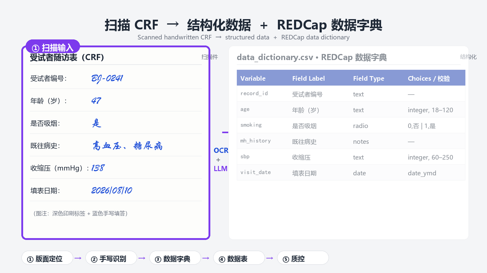

# 🩻 CRF-OCR-Entry

> 把扫描/拍照的纸质病例报告表（CRF）与临床问卷——**尤其是手写填答的那一摞**——一键变成「结构化数据 + REDCap 数据字典 + 质控报告」。
>
> Scanned paper Case Report Forms → structured data + REDCap data dictionary + QC report, in one pass.

<p align="center">
  
  
  
  
  
</p>

<p align="center">
  
</p>

---

## 🎯 它解决什么痛点

临床试验和随访研究里，最耗人、最容易错的一步，是**把纸上的 CRF 敲进 EDC**。尤其是：

- 大量**手写**填答（普通 OCR 直接翻车）；
- 表格/勾选框/单位混排，结构凌乱；
- 录完还要建 REDCap 数据字典、再做一遍质控。

本 skill 把「OCR 识别 → 数据字典 → 数据表 → 质控」串成一条可复现的流水线，交给 Claude 逐环节执行。

## 🧠 核心思路：分工，而不是让一个 OCR 硬啃手写

| 环节 | 谁来做 | 为什么 |
|---|---|---|
| 版面 / 表格 / 印刷字定位 | **PaddleOCR（PP-Structure）** | 对印刷字、中英混排、表格结构识别极强 |
| 手写 / 勾选 / 涂改识别 | **多模态 LLM**（Qwen-VL / GPT-4o / Claude 等） | 视觉理解手写远胜传统 OCR |
| 数据字典 + 数据表 + SAS | Python 脚本 | 规则化、可复现 |
| 质控报告 | Python 脚本 | 缺失 / 越界 / 逻辑矛盾 / 重复 |

**关键顺序**：先定数据字典（明确「有哪些字段、什么类型、什么取值」），再抽取数据，最后做质控。字典是质控的输入——没有字典，质控无从判断「什么值非法」。

## 🔄 五步流水线

```
扫描 CRF（PDF/图片）
  ├─ [1] 版面/表格定位   scripts/ocr_layout.py        （PaddleOCR PP-Structure）
  ├─ [2] 手写字段识别    scripts/extract_handwriting.py （多模态 LLM 读手写/勾选）
  ├─ [3] 生成数据字典    scripts/build_redcap.py        （REDCap CSV）
  ├─ [4] 组装数据表      scripts/build_redcap.py        （CSV / Excel / SAS）
  └─ [5] 数据质控        scripts/quality_check.py       （Python 报告）
```

## 🚀 快速开始

```bash
# 1) 依赖（详见 references/paddleocr_setup.md，务必先固定版本）
conda create -n crfocr python=3.10 -y && conda activate crfocr
pip install paddleocr paddlepaddle openai pandas openpyxl pymupdf
pip install pyreadstat   # 可选：导出 .sas7bdat

# 2) 准备好字段清单 schema.json（变量名/类型/取值域，即「契约」）

# 3) 版面定位
python scripts/ocr_layout.py --input crf_scan.pdf --out work/ --lang ch

# 4) 手写识别（OpenAI 兼容接口，Qwen-VL / GPT-4o / Claude 三件套切换）
python scripts/extract_handwriting.py \
  --layout work/layout.json --crops work/crops \
  --schema schema.json --out work/extracted.json \
  --base-url https://dashscope.aliyuncs.com/compatible-mode/v1 \
  --model qwen-vl-max --api-key $DASHSCOPE_API_KEY

# 5) 生成数据字典 + 数据表（CSV / Excel / SAS）
python scripts/build_redcap.py \
  --schema schema.json --extracted work/extracted.json \
  --out work/ --form-name baseline

# 6) 质控报告
python scripts/quality_check.py \
  --data work/data.csv --dictionary work/data_dictionary.csv \
  --out work/qc_report.md
```

## 📦 输出物一览

| 文件 | 说明 |
|---|---|
| `work/layout.json` | 版面/表格/单元格坐标 + 印刷字 |
| `work/crops/` | 每个单元格的裁剪图（供 LLM 读手写） |
| `work/extracted.json` | 每条记录一个对象，拿不准的值标 `uncertain` + 理由 |
| `work/data_dictionary.csv` | REDCap 标准数据字典，可直接导入建库 |
| `work/data.csv` / `data.xlsx` | 宽表（一行一个受试者，一列一个变量） |
| `work/data.sas7bdat` | SAS 格式（或 `import_data.sas` 替代） |
| `work/qc_report.md` | 质控报告 |

## ✅ 质控报告查什么

- **完整性**：每个变量的缺失率、缺失模式；
- **取值域**：数值 min/max 越界、分类取值不在 choices 内；
- **一致性**：跨字段逻辑矛盾（如「性别=男」但「妊娠史=有」）、日期先后颠倒；
- **重复**：`record_id` 重复、整行完全重复；
- **类型**：数值列出现非数值、日期格式不合法。

## 🧩 目录结构

```
crf-ocr-entry/
├── SKILL.md                              # Claude Skill 定义（name/description/流程）
├── README.md                             # 本文件
├── LICENSE                               # MIT
├── docs/
│   ├── demo.png / demo.gif               # before/after 演示图（静态 + 动画）
│   └── example/                          # 可复现运行示例（虚构数据）
├── references/
│   ├── paddleocr_setup.md                # PaddleOCR 安装 / 版本 pin / 排坑
│   └── redcap_dictionary_schema.md        # REDCap 数据字典列规范与示例
└── scripts/
    ├── ocr_layout.py                     # Step 1：版面/表格定位
    ├── extract_handwriting.py            # Step 2：多模态 LLM 手写识别
    ├── build_redcap.py                   # Step 3&4：数据字典 + 数据表
    └── quality_check.py                  # Step 5：数据质控
```

## 📖 运行示例

仓库自带一个**可复现的虚构数据示例** [`docs/example/`](docs/example/)——无需 OCR/LLM 即可看到 Step 3→5 的真实输入输出：

- `schema.json` + `extracted.json`：字段契约 + 模拟手写抽取结果（**故意埋了 8 处错误**）；
- `data_dictionary.csv`：REDCap 标准数据字典；
- `data.csv`：宽表；
- `qc_report.md`：质控报告，把缺失 / 越界 / 非法取值 / 重复 / 日期格式错逐条抓出。

```bash
python scripts/build_redcap.py --schema docs/example/schema.json \
  --extracted docs/example/extracted.json --out docs/example --form-name baseline
python scripts/quality_check.py --data docs/example/data.csv \
  --dictionary docs/example/data_dictionary.csv --out docs/example/qc_report.md
```

详见 [`docs/example/README.md`](docs/example/README.md)。

## 🛡️ 隐私与合规

患者数据请用**本地部署**（PaddleOCR 本地 + 自建/签约的 LLM 接口），**不要**使用免费在线 OCR 网站。关键结局变量与 `uncertain` 字段必须保留**人机复核清单**。

## ⚠️ 常见坑

1. **手写靠 LLM，别省这步** —— 纯 PaddleOCR 读手写会显著漏读/错读。
2. **人工复核不可省** —— `uncertain` / 低置信字段必须留复核。
3. **字段清单先定** —— 变量名一开始就按 CDISC/REDCap 规范起（`dm_`/`lb_`/`vs_`…）。
4. **PaddleOCR 版本** —— 2.x 与 3.x API 不兼容，先按 reference 固定版本再跑。

## 🤝 适用场景

- 批量扫描/拍照 CRF、问卷、随访表、检查单的自动录入；
- 需要生成 REDCap 数据字典 / 变量词典，或导入 EDC 建库；
- 手写临床数据转录、医学表单 OCR 识别；
- 需要自动缺失 / 取值域 / 一致性 / 重复核查。

---

**Made for clinicians & data managers who are tired of hand-typing handwritten CRFs.**
